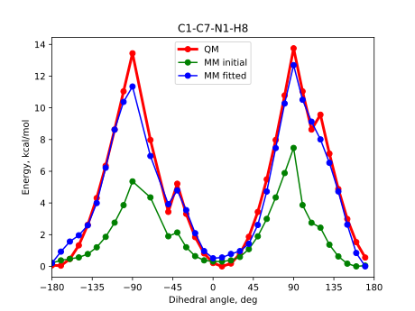

Parameterization of benzamidine
===============================

This tutorial showcases the features of ``parameterize`` using benzamidine as an example.

Prepare molecule
----------------

The structure of a molecule has to be in MOL2 format.

.. note::

    The protonation state and charge of the molecule has to be correct.

For benzamidine, it can be downloaded from *HTMD* repository:

.. code:: bash

    wget https://raw.githubusercontent.com/Acellera/htmd/master/htmd/data/test-param/benzamidine.mol2

``benzamidine.mol2`` file contains a molecule ready for parameterization.

Get command-line options
------------------------

``parameterize`` command-line options can be shown using:

.. code:: bash

    parameterize -h

.. argparse::
    :ref: htmd.parameterization.cli.getArgumentParser
    :prog: parameterize
    :nodefault:

Set total charge
----------------

The total charge of the molecule is set to a sum of the atomic partial charges from the structure file. If necessary,
it can be overridden with ``--charge`` flags, i.e. ``--charge -2`` set the total charge of a molecule to -2.

.. warning::

    An incorrect combination of the total charge and a protonation state may result into QM code failure.

In case of benzamidine, it is in a protonated state with the total charge of +1. ``benzamidine.mol2`` does not have
partial atomic charges, so ``--charge 1`` has to be set.

Choose force field
------------------

The initial parameters for *AMBER* is based on *GAFF* or *GAFF2*, while for *CHARMM* it is *CGenFF*. By default, the
parameters are generated for *GAFF2*. It can be changed with the ``--forcefield`` flag, i.e. ``--forcefield CGENFF``
switches to *CGenFF*.

The tool can be used to obtain just GAFF, GAFF2 or CGenFF parameters, (without any QM calculations) by setting the
``--no-min``, ``--no-esp`` and ``--no-dihed`` flags:

.. code:: bash

    parameterize benzamidine.mol2 --charge 1 --no-min --no-esp --no-dihed --outdir initial

The results are written to ``initial/parameters/GAFF2`` directory (the root directory is specified with ``--outdir``
flag).

List parameterizable dihedral angles
------------------------------------

Parameterizable dihedral angles for a given molecule can be listed using the ``--list `` flag.

.. code:: bash

    parameterize benzamidine.mol2 --list

::

    === Parameterizable dihedral angles ===

      C1-C7-N1-H8
      C2-C1-C7-N1

.. note::

    Symmetry equivalent dihedral angles are taken into account and are not shown in the list.

Choose QM code
--------------

By default, *Psi4* is used for all QM calculations. QM code can be changed with ``--code`` flag, i.e.
``--code Gaussian`` switches *Psi4* to *Gaussian 09*.

.. note::

    *Gaussian 09* is not distributed with *HTMD*. It has to be installed separately.

Choose QM level
---------------

The default QM level is the density functional theory (DFT) with B3LYP exchange-correlation functional and DFT-D3
dispersion correction. The level of theory can be changed with the ``--theory`` flag, i.e. ``--theory HF`` switches to
Hartree-Fock method.

The default basis sets are ``cc-pVZD``, though for a negatively charged molecule, the more diffuse ``aug-cc-pVZD`` are
used. The basis sets can be changed with ``--basis`` flag, i.e. ``--basis 6-31G*``.

The default QM environment (solvation model) is vacuum. It can be changed with the ``--environment`` flag, i.e.
``--environment PCM`` switches to the polarizable continuum model (PCM).

Control the execution of QM calculations
----------------------------------------

QM calculations for dihedral parameters fitting may require hundreds of QM calculations. Several queuing systems can be
used parallelize and distribute QM calculations. The system can be chosen with ``--queue`` flag, i.e. ``--queue Slurm``
switches to use *Slurm*. By default, QM calculations are performed on the local machine (``--queue local``).

.. note::

    A queuing system has to be properly configured for ``parameterize``.

In case of ``--queue local``, the number of CPU cores per QM calculation can be set with ``--ncpus`` flag, i.e.
``--ncpus 4`` switches to use 4 cores. By default, only 1 core is used per QM calculation, so if a local machine
has an 8-core CPU, 8 QM calculation are performed simultaneously.

Benzamidine parametrization on the local machine:

.. code:: bash

    parameterize benzamidine.mol2 --charge 1 --outdir local

.. note::

    Parameterizations can takes up to 12 hours depending on your machine.

Benzamidine parameterization with Slurm queuing system:

.. code:: bash

    parameterize benzamidine.mol2 --charge 1 --queue Slurm --outdir Slurm

The computation resources needed for the QM calculation depend on the number of atom and the number of
parameterizable dihedral angles::

    36 x number of dihedral angles x single QM calculation time

Reuse QM and re-parametrize
---------------------------

The QM calculation results are save into subdirectories named ``<theory>-<basis-set>-<environment>``::

    slurm/
    ├── dihedral-opt
    │   ├── C1-C7-N1-H8
    │   │   └── B3LYP-cc-pVDZ-vacuum
    │   │       ├── 00000
    │   │       │   ├── psi4.in
    │   │       │   ├── psi4.out
    │   │       │   ├── psi4out.xyz
    │   │       │   └── run.sh
    │   │       ├── 00001
    │   │       │   ├── psi4.in
    │   │       │   ├── psi4.out
    │   │       │   ├── psi4out.xyz
    │   │       │   └── run.sh
    │   │       (...)
    │   ├── C2-C1-C7-N1
    │   │       ├── 00000
    │   │       │   ├── psi4.in
    │   │       │   ├── psi4.out
    │   │       │   ├── psi4out.xyz
    │   │       │   └── run.sh
    │   │       ├── 00001
    │   │       │   ├── psi4.in
    │   │       │   ├── psi4.out
    │   │       │   ├── psi4out.xyz
    │   │       │   └── run.sh
    │   │       (...)
    │   (...)
    ├── esp
    │   └── B3LYP-cc-pVDZ-vacuum
    │       └── 00000
    │           ├── grid.dat
    │           ├── grid_esp.dat
    │           ├── psi4.in
    │           ├── psi4.out
    │           ├── psi4out.xyz
    │           └── run.sh
    └── minimize
        └── B3LYP-cc-pVDZ-vacuum
            └── 00000
                ├── psi4.in
                ├── psi4.out
                ├── psi4out.xyz
                └── run.sh

This allows a quick refitting. For example, the previous command ran QM calculations and fitted benzamidine parameters
for *AMBER*. The parameters for *CHARMM* can be fitted by reusing the calculations:

.. code:: bash

    parameterize benzamidine.mol2 --charge 1 --forcefield CGENFF --outdir slurm

.. note::

    Force field fitting does not use a queuing system, so there is no need to set `--queue`.

Find and validate parameters
----------------------------

The fitted parameter files are writen to `<outdir>/parameters` directory::

    slurm/parameters
    ├── CGenFF_2b6
    │   └── B3LYP-cc-pVDZ-vacuum
    │       ├── energies.txt
    │       ├── mol.mol2
    │       ├── mol.pdb
    │       ├── mol.prm
    │       ├── mol.psf
    │       ├── mol.rtf
    │       └── plots
    │           ├── C1-C7-N1-H8.svg
    │           ├── C2-C1-C7-N1.svg
    │           └── conformer-energies.svg
    └── GAFF2
        └── B3LYP-cc-pVDZ-vacuum
            ├── energies.txt
            ├── mol.coor
            ├── mol.frcmod
            ├── mol.mol2
            ├── mol.pdb
            ├── plots
            │   ├── C1-C7-N1-H8.svg
            │   ├── C2-C1-C7-N1.svg
            │   └── conformer-energies.svg
            └── tleap.in

The directory contains a folder for each fitted force field (`CGenFF` and `GAFF2`) with structure, topology, and
parameters files.

The quality of the parameters can be inspected by comparing rotamer energies. For convenience, several plots are
provided in `plots` subdirectory:

The fitting of dihedral parameters is global optimization problem. In some case, the fitting procedure may fail to find
the global minimum. This problem can be rectified by changing the random number seed of the optimizer. The seed is set
with `--seed` flag, i.e. `--seed 12345678`.
