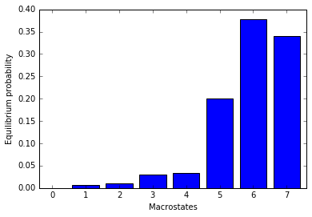
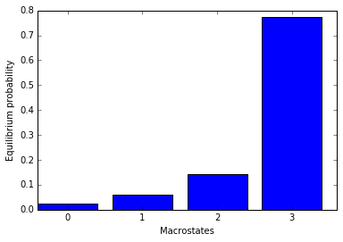

Conformational analysis of CXCL12
=================================

by Gerard Martinez

Download all the required files for the tutorial from this
`link <http://pub.htmd.org/confana1036hbl2450olw/filtered.tar.gz>`__

(warning: 2.6 Gb)

You can watch the presentation `here <https://youtu.be/I9VISC29Gc4>`__

.. code:: python

    from htmd import *
    htmd.config(viewer='ngl')
    %pylab inline
    os.chdir('/webdata/confana1036hbl2450olw/')  # Skip this command.

.. parsed-literal::

    HTMD. All material of HTMD2015 will be soon made available
    
    New HTMD version (0.1.15) is available. You are currently on (0.1.13). Use 'conda update htmd' to update to the new version.
    Populating the interactive namespace from numpy and matplotlib

.. parsed-literal::

    WARNING: pylab import has clobbered these variables: ['random']
    `%matplotlib` prevents importing * from pylab and numpy

1. Introduction
---------------

CXCL12 is a chemokine involved in...
~~~~~~~~~~~~~~~~~~~~~~~~~~~~~~~~~~~~

-  many types of cancer
-  inflammatory diseases
-  early development events

We performed...
~~~~~~~~~~~~~~~

-  ~300 simulations x 200ns each (~60 microseconds in total)
-  we filtered out the water from our trajectories

.. figure:: http://pub.htmd.org/confana1036hbl2450olw/system-protein2.png
   :alt: 

2. Sampling major conformational states
---------------------------------------

In our lab we have tried many different metrics to assess the overall
conformational changes of a protein. From them all, phi and psi angles
of the protein backbone (dihedrals) have been the most successful
descriptors in "blindly" capturing the major protein conformations.

In this section we will project our trajectories on the backbone
dihedrals and, we will reduce the dimensionality by using tICA and then
we will build a Markov Model to asses the major protein conformations in
equilibrium.

.. figure:: http://pub.htmd.org/confana1036hbl2450olw/conformations.png
   :alt: 

Calculate metrics: protein backbone dihedrals
---------------------------------------------

.. code:: python

    fsims = simlist(glob('./filtered/*/'), './filtered/filtered.pdb')

.. parsed-literal::

    2015-12-17 14:06:50,142 - htmd.simlist - INFO - Starting listing of simulations.
    Creating simlist: 100% (289/289) [#################################] eta 00:00 -
    2015-12-17 14:06:50,501 - htmd.simlist - INFO - Finished listing of simulations.

CXCL12 has a very flexible C-terminus loop as well as a transiently
disorderable N-terminal alfa helix. In this study we are not interested
in them but in the core of the chemokine. For this reason, we will
select residues from 10 to 54.

.. code:: python

    data = MetricDihedral.project(fsims, protsel='protein and resid 10 to 54', 
                                  sincos=True)
    data.fstep = 0.1

.. parsed-literal::

    2015-12-17 14:06:51,427 - htmd.projections.metricdiherdal - INFO - Precalculating phi and psi angle atom selections
    2015-12-17 14:06:52,316 - htmd.projections.metricdiherdal - INFO - Finished precalculating phi and psi.
    2015-12-17 14:06:52,332 - htmd.projections.metric - INFO - Metric: Starting projection of trajectories.

.. parsed-literal::

    [Parallel(n_jobs=-2)]: Done   1 out of 289 | elapsed:    0.7s remaining:  3.5min
    [Parallel(n_jobs=-2)]: Done  21 out of 289 | elapsed:    1.7s remaining:   22.2s
    [Parallel(n_jobs=-2)]: Done  48 out of 289 | elapsed:    3.8s remaining:   19.1s
    [Parallel(n_jobs=-2)]: Done  75 out of 289 | elapsed:    5.7s remaining:   16.3s
    [Parallel(n_jobs=-2)]: Done 102 out of 289 | elapsed:    7.5s remaining:   13.7s
    [Parallel(n_jobs=-2)]: Done 129 out of 289 | elapsed:    9.3s remaining:   11.5s
    [Parallel(n_jobs=-2)]: Done 156 out of 289 | elapsed:   11.1s remaining:    9.4s
    [Parallel(n_jobs=-2)]: Done 183 out of 289 | elapsed:   13.2s remaining:    7.7s
    [Parallel(n_jobs=-2)]: Done 210 out of 289 | elapsed:   15.0s remaining:    5.6s
    [Parallel(n_jobs=-2)]: Done 237 out of 289 | elapsed:   16.9s remaining:    3.7s
    [Parallel(n_jobs=-2)]: Done 264 out of 289 | elapsed:   18.6s remaining:    1.8s
    [Parallel(n_jobs=-2)]: Done 289 out of 289 | elapsed:   20.5s finished

.. parsed-literal::

    2015-12-17 14:07:13,086 - htmd.projections.metric - INFO - Finished projecting the trajectories.
    2015-12-17 14:07:13,088 - htmd.projections.metric - WARNING - Multiple framesteps were read from the simulations. Taking the statistical mode: 0.1ns. If it looks wrong, you can modify it by manually setting the MetricData.fstep property.

.. code:: python

    data.plotTrajSizes()

.. image:: conformational-analysis-CXCL12_files/conformational-analysis-CXCL12_8_0.png

Dimensionality reduction
------------------------

.. code:: python

    tica = TICA(data, 20)
    dataTica = tica.project(3)

Clustering
----------

.. code:: python

    dataTica.cluster(MiniBatchKMeans(n_clusters=200), mergesmall=5)

MSM analysis and visualization
------------------------------

.. code:: python

    model = Model(dataTica)
    model.plotTimescales(lags=list(range(1,1000,50)))

.. image:: conformational-analysis-CXCL12_files/conformational-analysis-CXCL12_14_0.png

.. code:: python

    model.markovModel(600, 8)
    eqDist = model.eqDistribution()
    print(eqDist)

.. parsed-literal::

    [  3.62227653e-04   6.27850327e-03   9.81777963e-03   2.96818659e-02
       3.44476993e-02   2.01180386e-01   3.78143163e-01   3.40088375e-01]

.. code:: python

    #we can now visualize representatives for each of the equilibrium species 
    model.numsamples=1
    model.viewStates(protein=True)

.. parsed-literal::

    [Parallel(n_jobs=-2)]: Done   1 out of   8 | elapsed:    6.5s remaining:   45.8s
    [Parallel(n_jobs=-2)]: Done   2 out of   8 | elapsed:   10.3s remaining:   31.0s
    [Parallel(n_jobs=-2)]: Done   3 out of   8 | elapsed:   14.2s remaining:   23.6s
    [Parallel(n_jobs=-2)]: Done   4 out of   8 | elapsed:   18.0s remaining:   18.0s
    [Parallel(n_jobs=-2)]: Done   5 out of   8 | elapsed:   21.8s remaining:   13.1s
    [Parallel(n_jobs=-2)]: Done   6 out of   8 | elapsed:   24.9s remaining:    8.3s
    [Parallel(n_jobs=-2)]: Done   7 out of   8 | elapsed:   29.3s remaining:    4.2s
    [Parallel(n_jobs=-2)]: Done   8 out of   8 | elapsed:   32.7s finished

Statistics
----------

What are the major differences between the states X and Y?
~~~~~~~~~~~~~~~~~~~~~~~~~~~~~~~~~~~~~~~~~~~~~~~~~~~~~~~~~~

.. code:: python

    means = getStateStatistic(model, data, range(model.macronum))
    plt.figure()
    plt.bar(range(len(means[0])), means[7] - means[6])
    idx = np.where(np.abs(means[7] - means[6]) > 0.6)[0]
    print(data.map[idx])

.. parsed-literal::

    ['Sine of angle of resid 16 atoms: N CA C resid 17 atoms: N '
     'Cosine of angle of resid 16 atoms: N CA C resid 17 atoms: N '
     'Sine of angle of resid 16 atoms: C resid 17 atoms: N CA C '
     'Cosine of angle of resid 24 atoms: N CA C resid 25 atoms: N '
     'Sine of angle of resid 32 atoms: N CA C resid 33 atoms: N '
     'Cosine of angle of resid 32 atoms: N CA C resid 33 atoms: N '
     'Sine of angle of resid 32 atoms: C resid 33 atoms: N CA C '
     'Sine of angle of resid 44 atoms: N CA C resid 45 atoms: N '
     'Cosine of angle of resid 44 atoms: N CA C resid 45 atoms: N '
     'Sine of angle of resid 44 atoms: C resid 45 atoms: N CA C ']

.. image:: conformational-analysis-CXCL12_files/conformational-analysis-CXCL12_18_1.png

.. code:: python

    # we can visualize which residues are different between states
    filtered = Molecule('./filtered/filtered.pdb')
    filtered.view(sel='protein',style='NewCartoon',hold=True)
    filtered.view(sel='resid 16 17 24 25 32 33 44 45',style='Licorice')

Mapping back
------------

Which trajectory originated the state X?
~~~~~~~~~~~~~~~~~~~~~~~~~~~~~~~~~~~~~~~~

.. code:: python

    np.where(model.macro_ofmicro == 6)

.. parsed-literal::

    (array([11, 12]),)

.. code:: python

    _,rel = model.sampleStates([10],[10],statetype='micro')
    print(rel)

.. parsed-literal::

    [array([[ 64,  81],
           [ 88,  53],
           [ 52, 203],
           [270, 482],
           [186,  97],
           [ 25,  30],
           [196, 115],
           [169, 178],
           [  4, 736],
           [175,  53]])]

.. code:: python

    print(model.data.simlist[232])

.. parsed-literal::

    id = 232
    parent = None
    input = []
    trajectory = ['./filtered/9x9/9x9-GERARD_VERYLONG_CXCL12_confAna-0-1-RND2283_9.filtered.xtc']
    molfile = ./filtered/filtered.pdb

3. Studying a defined reaction coordinate
-----------------------------------------

Revising the literature related to CXCL12, we find a paper published by
Andrea Bernini et al. (2014) where they describe the opening of a pocket
in CXCL12 located between the 2nd and 3rd beta sheet (see pictures
attached). To try to capture this phenomenon in our simulations, we will
project our trajectories along the 2nd and 3rd beta-sheet distance.

|image0| |image1|

*Figures extracted from "Searching for protein binding sites from
Molecular Dynamics simulations and paramagnetic fragment-based NMR
studies", Andrea bernini et al., 2014 Mar;1844(3):561-6. doi:
10.1016/j.bbapap.2013.12.012. Epub 2013 Dec 27*

.. |image0| image:: http://pub.htmd.org/confana1036hbl2450olw/openclose_struc.jpg
.. |image1| image:: http://pub.htmd.org/confana1036hbl2450olw/openclose_asa.png

.. code:: python

    # The first selection corresponds to beta-sheet 2 carbons alpha, the second one to beta-sheet 3 CA.
    # We specify metric='contacts' to create contact maps instead of proper distances,
    # this means: create an interatom matrix and put 1 if the distance is below cutoff; 0 otherwise. 
    data3 = MetricDistance.project(fsims, 'resid 38 to 42 and noh', 
                                   'resid 22 to 28 and noh', metric='contacts')
    data3.fstep = 0.1

.. parsed-literal::

    [Parallel(n_jobs=-2)]: Done   1 out of 289 | elapsed:    1.7s remaining:  8.2min
    [Parallel(n_jobs=-2)]: Done  21 out of 289 | elapsed:    3.3s remaining:   42.5s
    [Parallel(n_jobs=-2)]: Done  48 out of 289 | elapsed:    6.6s remaining:   33.0s
    [Parallel(n_jobs=-2)]: Done  75 out of 289 | elapsed:    8.9s remaining:   25.4s
    [Parallel(n_jobs=-2)]: Done 102 out of 289 | elapsed:   12.2s remaining:   22.4s
    [Parallel(n_jobs=-2)]: Done 129 out of 289 | elapsed:   15.4s remaining:   19.1s
    [Parallel(n_jobs=-2)]: Done 156 out of 289 | elapsed:   18.3s remaining:   15.6s
    [Parallel(n_jobs=-2)]: Done 183 out of 289 | elapsed:   21.3s remaining:   12.3s
    [Parallel(n_jobs=-2)]: Done 210 out of 289 | elapsed:   24.5s remaining:    9.2s
    [Parallel(n_jobs=-2)]: Done 237 out of 289 | elapsed:   27.9s remaining:    6.1s
    [Parallel(n_jobs=-2)]: Done 264 out of 289 | elapsed:   30.8s remaining:    2.9s
    [Parallel(n_jobs=-2)]: Done 289 out of 289 | elapsed:   33.6s finished

.. code:: python

    # tICA projection (dimensionality reduction along the slow process)
    tica3 = TICA(data3, 20)
    dataTica3 = tica3.project(3)

.. code:: python

    # Clustering
    dataTica3.cluster(MiniBatchKMeans(n_clusters=200), mergesmall=5)

.. code:: python

    # Plot timescales
    model3 = Model(dataTica3)
    model3.plotTimescales(lags=list(range(1,1000,50)))

.. image:: conformational-analysis-CXCL12_files/conformational-analysis-CXCL12_28_0.png

.. code:: python

    # Make Markov Model. we want to pick a lagtime where the timescales are converged (timescale is flat).
    # 600 is the lagtime we want to use (600 frames is equivalent to 60ns). 4 is the number of macrostates.
    model3.markovModel(600, 4)
    eqDist = model3.eqDistribution()
    print(eqDist)

.. parsed-literal::

    [ 0.02292385  0.06099237  0.14430835  0.77177542]

.. code:: python

    # Visualize states
    model3.numsamples = 1
    model3.viewStates(protein=True)

.. parsed-literal::

    [Parallel(n_jobs=-2)]: Done   1 out of   4 | elapsed:   10.6s remaining:   31.8s
    [Parallel(n_jobs=-2)]: Done   2 out of   4 | elapsed:   16.5s remaining:   16.5s
    [Parallel(n_jobs=-2)]: Done   3 out of   4 | elapsed:   22.7s remaining:    7.6s
    [Parallel(n_jobs=-2)]: Done   4 out of   4 | elapsed:   27.2s finished

.. figure:: http://pub.htmd.org/confana1036hbl2450olw/conformation_open.png
   :alt: 

Did you see any macrostate where the pocket is open? what is the
equilibrium population probability? Let's try to find the trajectory
that produced the state...

.. code:: python

    # Map back the trajectory/ies that originated the macro. Substitute 1 for the macro that showed the pocket opening.
    # This function is giving you the microclusters that are inside a given macrocluster
    np.where(model3.macro_ofmicro ==1)

.. parsed-literal::

    (array([ 2,  6, 23, 46]),)

.. code:: python

    # substitute 48 for the micro number from the previous step
    # This function gives you trajectory-frame pairs that visited a given micro
    _,rel = model3.sampleStates([48],[5],statetype='micro')
    print(rel)

.. parsed-literal::

    [array([[ 228,  672],
           [  23, 1016],
           [ 159,  265],
           [ 124,  739],
           [ 124,  399]])]

.. code:: python

    print(model3.data.simlist[277])

.. parsed-literal::

    id = 277
    parent = None
    input = []
    trajectory = ['./filtered/10x23/10x23-GERARD_VERYLONG_CXCL12_confAna-0-1-RND9861_9.filtered.xtc']
    molfile = ./filtered/filtered.pdb

.. code:: python

    # Calculate RMSD of the site of interest for a selected trajectory
    simus = simlist(glob('./filtered/10x23/'), './filtered/filtered.pdb')

.. parsed-literal::

    Creating simlist: 100% (1/1) [#####################################] eta --:-- |

.. code:: python

    refmol = Molecule('./filtered/filtered.pdb')
    rmsd = MetricRmsd.project(simus, refmol, 'resid 38 to 42 or resid 22 to 28 and noh', trajalnstr='protein')

.. parsed-literal::

    [Parallel(n_jobs=-2)]: Done   1 out of   1 | elapsed:    1.9s remaining:    0.0s
    [Parallel(n_jobs=-2)]: Done   1 out of   1 | elapsed:    1.9s finished

.. code:: python

    # Do you see the pocket opening at 50ns?
    plt.plot(rmsd.dat[0])
    plt.xlabel('Simulation length (frames; 0.1ns)', fontsize=10)
    plt.ylabel('RMSD (Angstroms)', fontsize=10)

.. parsed-literal::

    <matplotlib.text.Text at 0x7fffd8a0b320>

.. image:: conformational-analysis-CXCL12_files/conformational-analysis-CXCL12_38_1.png

.. code:: python

    # You can also visualize the trajectory from your browser
    refmol.read('./filtered/10x23/10x23-GERARD_VERYLONG_CXCL12_confAna-0-1-RND9861_9.filtered.xtc')
    refmol.align('protein')
    refmol.view()

.. figure:: http://pub.htmd.org/confana1036hbl2450olw/view_trajectory.png
   :alt: 
